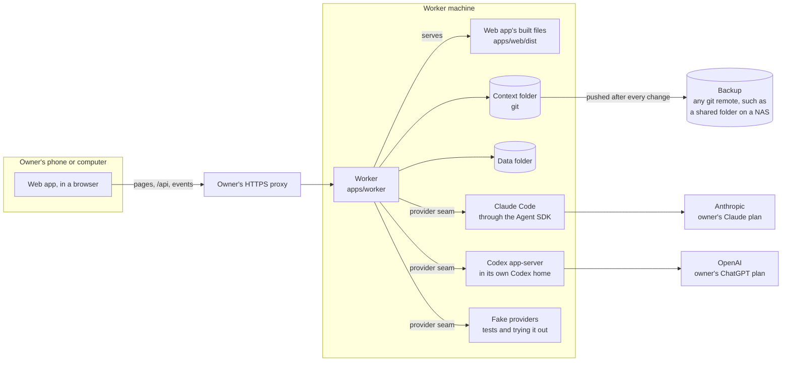
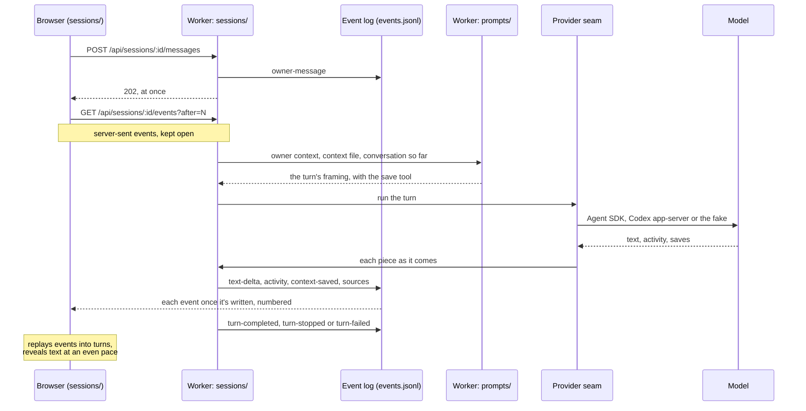

# Architecture

How Courtyard's parts fit together: a map for the owner and for any model working on this repo. What Courtyard does is
in the spec issues on GitHub (the original is [`spec.md`](spec.md), frozen), why it's built this way is in [`adr/`](adr/), and how to run it is in the
[README](../README.md). This map names the parts and how they connect, and links to those for the rest.

[AGENTS.md](../AGENTS.md) (Process) says when a PR updates this map.

## The big picture

Courtyard is two parts. The **web app** is what the owner opens in a browser: it shows things and asks the worker,
and keeps nothing itself. The **worker** does everything else: it checks the owner's login, keeps the context folder
and the data folder, and runs sessions by talking to providers. Both run from one machine, and the owner reaches them
through their own HTTPS proxy ([ADR 0001](adr/0001-the-worker-owns-everything-the-web-app-is-static-files.md),
[ADR 0002](adr/0002-one-owner-private-network-https-through-the-owners-proxy.md)).

- **One origin.** The worker serves the web app's built files and its API (under `/api`) at the same address, so the
  browser never talks to anything else.
- **Two folders hold everything kept.** The context folder is what models know about the owner and their workspaces;
  the data folder is Courtyard's own working state (sessions, logins, sign-ins). Neither is inside this repo.
- **Providers sit behind one seam.** Claude, Codex and the fakes look the same to the rest of the worker. Claude and
  Codex run on the owner's own subscriptions.

## The parts

The worker is split into modules, one folder each: `index.ts` is what the module does and `routes.ts`, when it has
one, is its part of the API. `worker.ts` builds every module from the settings and wires them together. The web app is
pages (`routes/`) built from feature folders and shared pieces. The contract package sits between them.

### The worker: `apps/worker/src`

**Starting up**

- **`main.ts`, `start.ts`:** start the worker: build it, then serve it on its port, or say which setting is wrong.
- **`settings.ts`:** reads and checks the worker's settings from the environment.
- **`worker.ts`:** builds every module and wires them together. Every API request passes its checks (body size,
  same-site JSON only, and logged in, apart from logging in itself). It also holds the routes for workspaces, the
  owner context, backup status and live updates, and serves the web app's files.

**The owner**

- **`owner/`:** the owner's password, each device login, and slowing down wrong guesses. Its routes are setup, login,
  logout, and the login check every other request goes through. Keeps its files in the data folder.

**Context**

- **`context-file/`:** reads a context file or the owner context into its sections, puts line labels on it for a
  model, and adds, changes or removes one line. Text in, text out: it never touches the disk.
- **`workspaces/`:** the list of workspaces: reads, creates, renames, recolours and archives workspace folders. Uses
  `context-file/` to read each `CONTEXT.md`.
- **`owner-context/`:** reads `OWNER.md` and starts a new one.
- **`context-folder/`:** the context folder as a git repository. Makes changes one at a time, each kept as a commit
  that says what kind of change it is. Commits hand edits, pushes to the backup, and reads the history back for Recent
  changes and Fresh start. Every module that changes the context folder goes through it. A change made file by file
  rather than line by line (a document's or a Thing's) names its files in `Courtyard-File` trailers, so
  `wholeFilesOf`, `stillAsLeft` and `undoWholeFiles` can read it back and undo it (as bytes, so a photo goes back as
  it was); `WHOLE_FILE_FOLDERS` are the workspace folders Recent changes looks in besides `CONTEXT.md`.
- **`documents/`:** a planning workspace's documents (ADR 0020): lists, reads, saves, renames and deletes them, each
  write one change through `context-folder/`; Save as document's text from an answer; and one turn's document tool,
  which keeps what the model has read so an update to a document it hasn't read, or one changed since, is refused.
  Its routes are a workspace's documents and each document (`/api/workspaces/:id/documents/:slug`).
- **`things/`:** a planning workspace's Things (ADR 0020): reads each `things/<slug>.md` against the contract's
  schema (listing a file that fails with its problem), lists them with each part after its Thing, adds, changes and
  removes one as one change through `context-folder/` (its photo with it), keeps a photo resized with `sharp`
  (`keptPhoto`), and one turn's Things tool, which labels the Things as the turn showed them and refuses a change to
  one changed since. Its routes are a workspace's Things, each Thing, and its photo
  (`/api/workspaces/:id/things/:slug/photo`). Add Thing and Edit send a photo picked in the form
  with the fields, as one multipart form, so both are one change with one Undo; these and the
  photo's route are the only multipart requests besides a message's (`THING_PHOTO_ROUTES`).
- **`planning-files/`:** what `documents/` and `things/` share: a planning workspace's folder (or why it has
  none), a file's name from what it's called, a path from the context folder's top and back, and the change note that
  names a change's files; and for their routes (`routes.ts`), the workspace and file a path names, and the answers
  for the refusals they share.
- **`saves/`:** checks a model's save and writes it as a change; the owner's Undo and Edit from a save's note. Uses
  `context-file/` and `context-folder/`.
- **`changes/`:** Recent changes: lists a file's changes from `context-folder/`'s history, and its documents' and
  Things', and undoes one from that page (a model's document or Thing save through its session, as a save is).
- **`tidy/`:** asks a model for a shorter file, holds the proposal until the owner saves it, then saves the ticked
  changes as one change.

**Models and sessions**

- **`providers/`:** the provider seam. `index.ts` says what every provider does (its status, its models, one turn,
  one-off questions, a sign-in when it has one). Behind it are three adapters: `claude.ts`, `codex.ts` and `fake.ts`.
- **`limits/`:** wraps every provider so it remembers a usage limit until its reset time and shows it on that
  provider's models.
- **`prompts/`:** everything a model reads, built from [`ai-conduct.md`](ai-conduct.md): each turn's framing
  (instructions with the documents and Things lists, the skills list and the skills in use, the conversation so
  far, and Courtyard's tools: the save tool, the document tool, the Things tool, use skill and suggest replies), the replies to Courtyard's
  tools, and the text for Tidy and titling a session.
- **`skills/`:** a workspace's skills (ADR 0016), worked out in one place, the more specific winning by name: the
  workspace's own `.agents/skills` in the context folder, a code workspace's repo's, the context folder's top-level
  one, in a code workspace Matt Pocock's from `matt-skills/` (ADR 0024, each marked for the picker or not), then the
  house skills for its kind of workspace from `packages/skills`. It keeps each
  skill's source, skips a broken one with why, keeps one with scripts out of a planning workspace, and answers the use
  skill tool: a skill's `SKILL.md`, or one of its files, confined to its folder.
- **`matt-skills/`:** Matt Pocock's skills for code workspaces
  ([ADR 0024](adr/0024-code-workspaces-load-matt-pococks-skills-as-a-plugin-from-a-pinned-copy.md)): fetches the
  release `packages/skills/matt.json` names from his plugin list into the data folder, keeping only his `plugin.json`,
  licence and the skills it lists, and gives the copy (`copy()`) only when it matches the pin's checksum
  (`mattChecksum`), or why not; a failure is tried again after five minutes. Fetching is a dependency passed in
  (`fetchFromGitHub`, git at his release's tag, the one real one). `sessions/` hands a code turn the copy as its
  `CodePlugin`, with the skills of it the workspace can use, and leaves them out of Courtyard's own skills list.
- **`matt-setup/`:** the setup check (#181): what a code workspace's repository is missing of what Matt's
  `setup-matt-pocock-skills` writes for the house answers (`docs/agents/` files and the Agent skills section, read
  from the default branch on its remote through `code/`, and the triage labels through `github/`), offered once.
  Allowed, it makes the labels and puts the files, from his templates in the pinned copy, on a branch of their own
  in a worktree in the data folder, pushes it and opens its pull request. Its routes are a workspace's `matt-setup`.
- **`suggested-replies/`:** checks the replies a model suggests with the suggest replies tool (ADR 0017): two or
  three, each a few words on one line, all different, one set per answer; once they're taken, keeps what the answer
  writes after them apart from lines it repeats.
- **`sources/`:** a turn's sources (ADR 0019), worked out the same way for every provider: the pages its answer
  links to and the pages the model read, each with its site's name and title; when it used none, the search results
  of a provider that gives them (Claude), those whose site the answer names or else all of them, each search's top
  results first, at most 20. Also finds the web addresses in the owner's messages, the only pages besides search
  results that Claude may read.
- **`sessions/`:** sessions as event logs. Starts and runs turns through a provider, answering each call to
  Courtyard's tools by name (one `callTool` on the provider seam, so a new tool needs no adapter change). A new tool
  is a name in `TurnToolName` (`providers/`), its definition beside its replies in `prompts/`, its answer in the
  turn's `answers` (which the compiler asks for), and a scripted line for the fake. It follows each
  one live from any position, and handles Stop, Carry on, titles, and Undo and Edit of saves. It queues a message
  sent while a turn runs and sends it once the turn ends (#177), and its list of a workspace's sessions says whose
  turn it is in each (#179). Its routes include the event stream, the
  list of models, Get to know (a session started with its house skill), Grill this plan, each attachment
  (`GET /api/sessions/:id/attachments/:attachment`), Save as document (`POST /api/sessions/:id/documents`), Undo
  of a document save (`POST /api/sessions/:id/documents/:save/undo`) or a Thing save
  (`POST /api/sessions/:id/things/:save/undo`), and removing a queued message
  (`DELETE /api/sessions/:id/queued/:queued`).
- **`code/`:** code sessions' git and what they may do
  ([ADR 0007](adr/0007-code-sessions-work-on-a-session-branch-in-its-own-worktree.md)). Starts a session's session
  branch (`courtyard/<start of its id>`) from the default branch on the repository's remote (`origin`, standing in
  for GitHub), freshly fetched, in its own worktree in the data folder, so the owner's checkout is never touched; or
  says why it can't (the repository missing, not git, or its remote unreachable). Decides each edit (inside the
  worktree once symlinks are followed; a file that decides what allowed commands run, such as a `package.json`, git
  hooks, `.claude` or git's own `.git`, needs an approval) and each command: `allowlist.ts` is the
  command allowlist, matched on the command's words once its quotes are read, never on the start of its text, so a
  command that chains, pipes, redirects or substitutes never matches; one naming a path outside the worktree is
  refused, and committing, pushing and the session's own PR need the worktree on the session branch. The default
  allowlist is the shell commands that look around the worktree (`cat`, `ls`, `grep`, `rg` and the like; #178), the
  package scripts, git and gh commands that only look, adding and committing, pushing the session
  branch (only to `origin`, under its own name, never forced) and `gh pr create`/`gh pr edit` on the session's own
  PR (#172); their flags are read, so one naming another branch, repository or PR, or one it doesn't know, asks.
  It also files, edits, comments on and closes the repository's issues and makes and lists its labels, never naming
  another repository, and reads through `gh api` with GET only (#181).
  A code workspace's `workspace.json` can add commands to it and remove default ones (`allowlist: { add, remove }`,
  read by `workspaces/`, built by `allowlistFor`). `sessions/` hands each code turn a `CodeTurn` (`providers/`), the
  worker's say on every edit and command, which records each one allowed as an activity and words each refusal
  through `prompts/`, and the environment its commands run in, with Courtyard's GitHub sign-in from `github/` (the
  module's own fetch from the remote uses it too). `slots.ts` keeps up to three code sessions running at once across the worker (#174), each
  turn holding a numbered slot no other running one holds; its commands get it as `COURTYARD_SESSION_SLOT`, which
  this repository's Playwright config picks its ports from, so side-by-side checks never share them. A turn beyond
  three waits, first come first served, until one ends. It also finds a session branch's pull request on GitHub
  (the repository named by its remote's address) and clears a session's worktree and branch away, and, once its PR
  is merged or closed, the branch it pushed to GitHub (only a `courtyard/…` one).
- **`paper/`:** Paper in code workspaces, the first tool connection
  ([ADR 0023](adr/0023-paper-is-the-first-tool-connection-in-code-workspaces.md)). Builds the turn's
  `ToolConnection` (`providers/`) from the workspace's Paper settings (`connections.paper` in `workspace.json`,
  read by `workspaces/`): Paper's MCP server as a command, and the worker's say on each call. Reading and drawing in
  the workspace's one Paper file run, each an activity (`used-tool`); another file, or making a file, is refused;
  deleting a node the session didn't make is an approval. It notes the nodes each call says it made (kept on the
  running session), hands each screenshot to `sessions/` to keep and show, and words a failed call through
  `prompts/`.
- **Following a pull request** (#172): `sessions/` looks at each code session's PR through `code/` and `github/`
  every 30 seconds (a repeating job) and as soon as a turn in one ends, one session at a time, and records each change
  as a `pull-request` event (its number, state, latest commit and checks), which the session page's branch and PR
  strip shows. Checks failing on a commit not yet asked about start a turn on the model the owner last used, once
  the session is free: its message is the worker's (`checksFailed` on it, worded by `prompts/`), and the failed
  checks open its activity. A PR merged or closed, anywhere, ends the session: it takes no more messages, and once
  no turn runs its worktree and branch are cleared away. Each `pull-request` event carries the PR's size (lines
  added and removed, files changed, #160), which the strip shows too.
- **Reviewing a pull request** (#160): `/api/sessions/:id/pull-request` answers with the session PR's review,
  asked of GitHub through `code/` and `github/` each time: its checks by name, the files it changes with their
  diffs, and whether it can merge, or why not in the owner's words (checks running or failed, or a conflict with its
  base). `pull-request/merge` takes the head commit the browser reviewed and refuses when the PR has moved since
  ("The pull request changed since you looked. Review it again."), or with that reason; else GitHub merges only that
  commit. `pull-request/close` closes it. Either then follows the PR at once, so the session ends as one merged or
  closed on GitHub does.
- **`attachments/`:** the photos and PDFs sent with a message (#78): checks each again as the browser did (Zod for
  its kind, size and the count, then that its first bytes are that kind), pulls a PDF's text out with `unpdf` and
  refuses one with none, keeps them in the session's folder, and gives each turn the session's last ten.
- **`sign-ins/`:** signing in to the providers whose sign-in Courtyard handles (Codex), and remembering the owner's
  Not now.
- **`github/`:** the only place that knows GitHub (#99). Courtyard signs in through a GitHub App the owner registered
  and installed on the repos they chose: a device code from Connections, then the token kept in the data folder,
  refreshed by a repeating job before it runs out, and forgotten when GitHub stops taking it. GitHub itself is a
  dependency passed in (`api.ts`, the one real one; `fake.ts` holds it in memory for the tests and the browser
  tests). It builds what a code session's commands get on top of their environment (`commandEnv`): `gh` reading
  Courtyard's own config folder, git's credential helpers replaced by `gh`'s and GitHub's SSH addresses turned to
  HTTPS, and every variable naming the machine's own login unset. While no one is signed in, that folder holds a
  stand-in that works nowhere, since `gh` would otherwise fall back to the machine's keyring. It reads a branch's
  latest pull request and the checks on its latest commit (#172), the files it changes with their diffs, and
  merges and closes it (#160); and lists and makes a repository's labels and opens a pull request (the setup
  check, #181). Its routes are
  `/api/github` and its `sign-in`, `cancel` and `sign-out`.
- **`notifications/`:** web push to the devices the owner turned notifications on for (#173). The worker's own keys
  (VAPID) are made on its first run; each device's subscription is kept by its device login, so a device that logs
  out gets no more, and one whose subscription has gone is forgotten. `sessions/` tells it of each approval asked
  for and each turn's end (its `notify` option); an approval, a finished turn and a failed one each send one
  notification, carrying only the session's title, what it needs and the session's id. The sender is a dependency
  passed in (`web-push.ts`, the one real one, through the `web-push` package; `fake.ts` keeps what was sent for the
  tests and the browser tests). Its routes are `/api/notifications` (the public key) and its `on` and `off`.

**Running Courtyard**

- **`fresh-start/`:** clears the context folder, sets every session aside, and drops any tidy waiting for review.
- **`live/`:** for the live copy only: whether `main` has moved on, starting an update, and how the last one went
  ([ADR 0011](adr/0011-the-live-worker-is-its-own-copy-of-main-started-at-log-on.md)).

**Helpers**, to reuse before writing a new one (AGENTS.md):

- **`http.ts`:** reads a request's body with a contract schema (JSON with files as a multipart form,
  `readWithFiles`: a message's attachments with `readMessage`, a Thing's photo with its form), and turns errors into
  answers.
- **`files.ts`:** reads, writes (making the folder, with `writeTextFileIn`) and removes files, and JSON checked with
  a schema.
- **`git.ts`:** runs git, never stopping to ask for a password.
- **`result.ts`:** the `Result` type.
- **`testing.ts`:** a worker on temporary folders, and helpers for the tests and the context eval.

Beside `src/`, **`apps/worker/eval/`** is the context eval (see [The AI setup](#the-ai-setup)).

### The web app: `apps/web/src`

- **`main.tsx`** starts the router, which moves the scroll only for a move to another page (to the top, or back
  to where that page was), never when a page reloads its data (#168). **`routes/`** holds one file per page (TanStack Router; `routeTree.gen.ts` is
  generated). `__root.tsx` checks the worker is reachable; `_app.tsx` is the layout behind the login, with the
  workspaces down the side or across the top; the rest are pages.
- **`worker.ts`** is how the web app asks the worker: every answer is parsed with the contract's schemas, and an
  offline worker or a refusal comes back as a value to show. **`send-form.ts`**, beside it so it's not on the first
  load, sends a multipart form (a message's files, a Thing's photo) the same way. **`worker-watch.ts`** checks the
  worker's health while a page needs it.
- **Feature folders**, each one feature's parts:
  - **`sessions/`:** the session page: following the event stream and replaying it into turns (`events.ts`),
    revealing text at an even pace (`reveal.ts`), formatting answers (`answer.tsx`, `blocks.ts`; tables and fenced
    blocks Courtyard draws come from `rich-blocks/`), code blocks with
    their language and Copy (`code-block.tsx`), coloured by lowlight (`highlight.tsx`, loaded with the first code
    block, each language's grammar from `code-languages.ts` only when used), formulas drawn by KaTeX (`maths.ts`
    finds and rewrites them, `maths-plugins.ts` is loaded only when an answer has maths), the turn list
    (`session-turns.tsx`, which follows the end only while the owner is at it, never moving them while they read
    back, and offers Jump to latest, #168), the
    message box with its model, effort and skill pickers and its attachments (`attaching.ts` shrinks photos to JPEG
    and checks each file; `messages.ts` sends a message with its files, beside `worker.ts` so it's not on the first
    load), save notes, the usage-limit notice with Carry on, the Get to know offer, Grill this plan beside each
    plan (`grill-plan.tsx`), an answer's Sources (`sources.tsx`), Save as document with each document's note
    (`documents.tsx`), and each Thing save's note (`things.tsx`).
  - **`rich-blocks/`:** the blocks Courtyard draws in answers and documents
    ([ADR 0021](adr/0021-rich-answers-are-blocks-courtyard-draws-itself.md)), through the answer renderer, so a
    document's page gets them too. Every table sorts by its columns (`table.tsx`, with `sorting.ts` saying how dates,
    prices and text sort), keeping its sort as rows stream in. **The seam for fenced blocks** is `fenced.tsx`: in
    `answer.tsx`, a fence whose language is a kind in its `FENCED_KINDS` (a `chart`, a `mermaid`) becomes a
    `FencedBlock`, which loads that kind's drawing (a module whose default export takes `DrawingProps`: the source,
    whether it's still `arriving`, and the `fallback`) the first time one is needed, never on the first load. The
    fallback is the code block with its problem line, "Couldn't draw this <noun>, so here's what the model wrote", or
    just the source while the block is still arriving; a drawing that throws shows it too. A `chart` block
    (`chart.tsx`) is the JSON the contract's `Chart` schema accepts, drawn by our own SVG as bars, lines or a pie in
    Moorland's colours by name, its values written on it, and scrolling sideways when crowded; `chart-scale.ts` works
    out its value axis. A `mermaid` block (`mermaid.tsx`) is drawn as a diagram by Mermaid once it has all arrived,
    one at a time, in Moorland's colours read from the theme (and again when the device turns dark or light), at its
    own size so a wide one scrolls sideways. Mermaid runs strict, with every one of its settings locked so a diagram's `%%{init}%%` or front matter
    changes nothing, laid out by dagre; `diagram-svg.ts` then takes out of its drawing anything that could still run
    script, load something or go somewhere (links keep their words) before it goes in the page, the one place
    Courtyard puts in markup it didn't write itself. Mermaid itself can still load a picture while drawing (a step
    with an `img`, an actor's icon), so the page's own policy (`index.html`) loads pictures only from Courtyard and
    such a diagram shows as written. The build takes Mermaid from its prebuilt files without its ELK layout
    (`mermaidAsDrawn` in `vite.config.ts`), so it adds nothing to the first load. The folder's classes are
    in its own Tailwind stylesheet (`rich-blocks.css`, which `styles.css` leaves the folder out of), added to the page
    by `stylesheet.ts` (through `lib/stylesheet.ts`) from inside the answer renderer's script, so neither the classes
    nor a stylesheet's name are on the first load. They apply only inside a `RichBlock` (`rich-block.tsx`), which
    each table and drawing is wrapped in, never a fallback: coming after the theme's stylesheet, they would otherwise
    outrank its screen-size variants on every page.
  - **`changes/`:** the Recent changes list, with Undo, its calls (`api.ts`), and the note a page shows for
    something just deleted from its own page, with Undo (`just-deleted.tsx`).
  - **`documents/`:** a workspace's Documents section (`documents-section.tsx`) and the documents' calls (`api.ts`);
    a document's page is in `routes/`, drawn with the answer renderer.
  - **`things/`:** a workspace's Things section (`things-section.tsx`, filtered by status), a Thing's card
    (`thing-card.tsx`, its route in `routes/`, its history drawn with the answer renderer), the rows both list them
    in, parts under their Thing (`thing-rows.tsx`), Add Thing's and Edit's form (`thing-form.tsx`), Things' calls
    (`api.ts`) and how their fields read (`words.ts`). Like `rich-blocks/`, its classes are in a stylesheet of its
    own (`things.css`, which `styles.css` leaves the folder out of), added by `stylesheet.ts` when one of its pages
    first loads, and applying only inside a `ThingsScope` (`scope.tsx`), for the same reason.
  - **`tidy/`:** asking for a tidy, and the review with its tick boxes.
  - **`review/`:** a code session's pull request, reviewed on its page in place of the conversation (`?view=review`,
    #160): check pills, the changed files as a tree (`components/file-tree.tsx`), the chosen file's diff
    (`diff.tsx`, long lines wrapping so it reads on a phone), and Close PR (confirmed) and Merge (greyed out with
    its reason) as thumb buttons (`components/thumb-button.tsx`, shared with the approval card). Its own lazy load,
    with its calls (`api.ts`) and a stylesheet of its own (`review.css`), like `things/`.
  - **`sign-ins/`:** the home page's sign-in box and Connections (each provider, and GitHub with its device code,
    account and repos, Switch and Sign out), and a code workspace's notice that GitHub isn't connected; one lazy
    load wherever they show.
  - **`fresh-start/`:** what a fresh start would clear, and starting one (its page is in `routes/`).
  - **`matt-setup/`:** the setup check's offer on a code workspace's page (#181), an approval card
    (`components/approval-card.tsx`, which a session's approvals use too) saying what's missing, then where its
    pull request is; its own lazy load, with its calls (`api.ts`).
  - **`notifications/`:** the home page's notifications toggle for this device, beside Connections (#173): it
    subscribes the browser with the worker's key and sends the subscription, sends it again each time the page
    opens (so it follows the device's login), and unsubscribes on off; its own lazy load.
- **Home page and login pieces** sit at the top of `src/`: the backup notice (`backup-status.tsx`), the live update
  notice (`live-update.tsx`), the owner context panel (`owner-context-panel.tsx`), the setup and login form
  (`password-page.tsx`), logging out other devices (`log-out-others.tsx`), what to show when the worker gives no data
  (`problems.tsx`), and how dates read (`when.ts`). Beside them, `workspace-page.ts` asks for everything a
  workspace's page shows; its route's loader imports it, so that code and its schemas aren't on the first load.
- **`components/`:** Courtyard's shared pieces (buttons, copy buttons, web links, text fields, file pickers, sheets, notices, Connections' cards and so on), used
  on every page ([ADR 0012](adr/0012-courtyards-own-building-blocks-safe-on-the-first-load.md)). One, a table
  heading's sort button (`sort-button.tsx`), only a rich block uses, so its classes are in `rich-blocks.css` with
  the folder's, and it's styled only inside a `RichBlock`. The pieces that keep a session's flow (#179, #177,
  #168) have a stylesheet of their own too (`chat-flow.css`), added when one first shows and applying only inside a
  `ChatFlowScope`: whose turn it is in a session (`session-state.tsx`, in the chat, a workspace's sessions and the
  sidebar's recent ones, which ask again every few seconds while one is working), the Working line and the Your turn
  mark (`working-line.tsx`), queued messages (`queued-message.tsx`) and Jump to latest (`jump-to-latest.tsx`).
  The frame round every page is picked by `handheld.ts` (#193): a desktop keeps the sidebar (`app-sidebar.tsx`) and,
  in a narrow window, the strip (`workspace-strip.tsx`); a touch screen gets the Handheld frame
  (`handheld-frame.tsx`), loaded only there with its own stylesheet (`handheld-frame.css`): thumb rails and a bottom
  bar with Type and the talk strip on a tablet or the unfolded Fold, tiles across the top on the folded one. The
  page's message box (`sessions/composer.tsx`) offers itself to the frame through `handheld.ts`'s dock, moves into
  it above the bar, and opens its pickers from the frame's Skills, Photo and Model buttons. The talk strip
  (`talk-strip.tsx`, #79, loaded with the frame) listens through the browser's own speech recognition
  (`speech.ts`, which also vibrates for it) and hands the words to the box to send, or to queue while a turn runs;
  nothing said reaches the worker except the words. The page stays mounted in the same place whichever frame is
  round it, so folding keeps its scroll and a half-written message. The frame's menus and the box's pickers open as Handheld sheets (`handheld-sheet.tsx`, #194): from the right edge
  beside the right rail on a tablet, from the bottom on a phone. The box's Skills and Model sheets
  (`sessions/handheld-choices.tsx`, built from `sheet-choices.tsx`) load only once it's docked; both files' classes
  are in `handheld-frame.css`. A desktop keeps the box's own pickers, and a narrow desktop window its bottom sheets
  (`sheet.tsx`).
  **`lib/`:** small
  helpers shared by pages. **`styles.css`:** the theme: Moorland by day, Handheld by night.
- Beside `src/`: **`public/`** has the service worker (which also shows a pushed notification, unless that
  session is open in front of the owner, and opens the session on a tap, asking the worker which workspace it's in)
  and the install manifest, and **`scripts/finish-build.mjs`**
  runs after each build to stamp the service worker with the files it keeps on install (all but Mermaid's, which it
  keeps once a diagram needs them) and check the first-load budget. `vite.config.ts` keeps everything
  the first load needs in one file, so a lazily loaded module that lazy code loads (a chart) can't split what it
  shares with the first load, such as React and Zod, into files of their own.

### The house skills: `packages/skills`

`@courtyard/skills` holds Courtyard's own skills, a folder each in the Agent Skills format, and `skills.json`: the
kinds of workspace that get each one and whether only the owner starts it (ADR 0016). It also holds the format check
(`checkSkill`, the reference validator's rules in TypeScript), which its own test runs on the house skills in
`pnpm verify` and the worker runs on everyone's. It's a package of its own so it can move to a repo of its own (#88).
`matt.json` pins the release of Matt Pocock's skills code workspaces get (ADR 0024): its version, the checksum of the
copy the worker keeps, and the ones the Skill picker lists.

### The contract: `packages/contract`

Every shape that crosses between the web app and the worker, as Zod schemas with their types inferred, one file per
topic in `lib/`: login, workspaces, sessions and their events (`session.ts` for what the home page needs,
`session-event.ts` for the events, which only the session page parses, and `session-state.ts` for whose turn it
is in each session a list shows, which only the pages listing sessions parse), attachments (an event's in `attachment.ts`,
a photo or a PDF by its media type, the limits and checks in `attachment-file.ts`), skills, saves and changes,
tidies, usage limits and overflow, sign-ins, backup, live updates, fresh start, health and errors, and a `chart`
block's JSON (`chart.ts`, which a model writes and the web app and the eval check). The worker's
answers are checked against these types;
the web app parses every answer with these schemas.

### Outside the apps

- **`e2e/`:** the browser tests. `start-worker.mjs` starts a real worker on fresh folders with the fake providers,
  the fake GitHub and a stand-in for Matt Pocock's plugin;
  `fixtures/context/` is the context folder they start from.
- **`scripts/live/`:** the live copy's scripts, for Windows: start the worker at log on, and update it (ADR 0011).
- **`.github/workflows/ci.yml`:** runs `pnpm verify` on every pull request and every push to `main`.
- **`.github/workflows/matt-skills.yml`:** once a week, runs `scripts/matt-skills/check.ts`, which compares
  `matt.json` with Matt's newest release and, when it's behind, writes an issue with his CHANGELOG lines and the new
  pin (its checksum worked out as the worker checks it); the workflow opens it, once per release (ADR 0024).

## How a turn flows

When the owner presses Send, the worker writes the message down and answers at once. The turn then runs on the
worker to the end, whether or not anyone is watching. Everything the model does is written to the session's event log
first, and only then sent to the browsers following it. The browser draws the session from those events alone, so a
page that reconnects, or opens later, asks for everything after the last event it saw and catches up
([ADR 0006](adr/0006-sessions-are-event-logs-in-plain-files.md)).

Where the rest fits:

- **Saves.** The model calls the save tool its framing offered. `saves/` checks the line and writes it as a change
  through `context-folder/` at once; the session records it and the browser shows a note. A refused save is explained
  to the model, which may put it right once
  ([ADR 0013](adr/0013-models-save-context-as-they-chat-and-the-owner-undoes.md)).
- **Documents.** The model calls the document tool, or the owner taps Save as document under an answer.
  `documents/` checks it and writes it as a change through `context-folder/`; the session records a
  `document-saved` event and the browser shows a note with Open and Undo. Each turn lists the documents; a model reads
  one with the file tools, and that read is what an update is checked against
  ([ADR 0020](adr/0020-documents-and-things-are-files-in-the-context-folder-saved-with-undo.md)).
- **Things.** The model calls the Things tool by the labels its turn listed. `things/` checks the call and writes it
  as a change through `context-folder/`, resizing a photo from the turn's attachments first; the session records a
  `thing-saved` event and the browser shows a note with Open, which goes to the Thing's card
  (`/workspaces/:id/things/:slug`), and Undo. The owner's own adds, edits, deletes and photo uploads, from the
  workspace page's Things section and each card, go through `things/`'s routes, each a change Recent changes can undo
  ([ADR 0020](adr/0020-documents-and-things-are-files-in-the-context-folder-saved-with-undo.md)).
- **Suggested replies.** The model calls the suggest replies tool its framing offered (planning workspaces only).
  `suggested-replies/` checks them; the session records them as an event and the browser shows them as buttons under
  the latest answer, once its turn completes, until the owner replies. A tap sends one as the owner's message
  ([ADR 0017](adr/0017-models-offer-suggested-replies-through-a-courtyard-tool.md)).
- **Web search.** In a planning workspace, a model searches the web with its provider's own search and reads pages
  (ADR 0019): Claude through Claude Code's `WebSearch` and `WebFetch`, the adapter's hook allowing a fetch only for a
  page in the turn's search results or a link the owner sent; Codex on cached search, set for its thread. Each search
  and page read is an activity. Once the answer is written, the provider hands the worker the turn's sources
  (`sources/`), which the session records as one `sources` event and the browser lists under the answer.
- **Code sessions.** Only a provider that codes works in a code workspace; any other is refused, saying so. A new
  session there starts its session branch and worktree (`code/`) before its first turn, and keeps the branch in its
  `session.json`. Each turn runs in the worktree, with a `CodeTurn` the provider asks before every edit and command:
  Claude's hook asks it for each `Edit`, `Write` and `Bash`, and the fake for each scripted line. Claude Code's
  background tasks are off, and the hook refuses a `Bash` call asking for the background without asking (#178): a
  turn's commands end with it. What's allowed shows
  as an activity (`edited-file`, `ran-command`). A command off the allowlist, an edit outside the worktree, or one to a
  file that decides what allowed commands run (an approval of its own kind, `setup`), is an
  approval (#171): the session records an `approval-requested` event and the `CodeTurn` call waits on it, with no time
  limit (Claude's hook too). Allow or Deny, from any device, goes through `sessions/` and is recorded as
  `approval-answered`, so the browser's card goes everywhere; the first answer stands. A stop ends the wait, and a
  denial tells the model why. With three code sessions' turns running, a fourth records `turn-queued` and waits, `turn-dequeued`
  once it starts; the workspace's sessions list marks it `queued`, with how many are running, and deleting it
  before it starts clears its branch and worktree away.
- **Tool connections.** A code workspace that names Paper hands each turn on a provider that uses tools a
  `ToolConnection` from `paper/` (ADR 0023). Claude's adapter passes its MCP server to Claude Code (a command it
  starts, `paper mcp`), its hook asks the connection about each of the server's tools, and its `PostToolUse` and
  `PostToolUseFailure` hooks hand each result back, adding what the worker says to a failure. A delete that asks is
  an approval of its own kind (`tool`), on the same card. Each screenshot is kept in the session's folder beside its
  attachments and recorded as an `image-shown` event, which the browser shows under the answer as a thumbnail, the
  newest of each board, from the attachment route.
- **Attachments.** A message with photos or PDFs goes as a multipart form: the message's JSON in one field, the
  files in another (with a Thing's photo, the only requests that aren't JSON, and the only ones allowed past the
  small body limit).
  `attachments/` checks them and keeps them in the session's folder; the owner message's event records each one, and
  the browser shows them from the attachment route. Each turn carries the session's last ten: `prompts/` puts each
  PDF's text in the message and lists the photos, which each provider sends its own way (below). They go with their
  session when it's deleted (docs/ai-conduct.md, Attachments).
- **Undo and Edit.** From a save's note, through `sessions/` to `saves/`; or from Recent changes, through `changes/`.
  Each is a change of its own, and the session records what the owner did to its save.
- **Stop.** The worker tells the provider to stop, stops waiting for it at once, and drops anything it sends
  after. What was written so far stays, and the turn is recorded as stopped.
- **Queued messages** (#177). A message sent while a turn runs (waiting for a code session's slot or an approval
  included) is recorded as `message-queued`, its attachments kept already, and every device shows it under the
  turn. Once the turn ends, however it ended, the first still queued goes as its own turn, its `owner-message`
  naming it (`queued`), checked in the session's queue so one removed meanwhile (`queued-message-removed`) never
  goes; after a usage limit they wait for the owner's next turn (Carry on, say). A queued message going first means
  no fixing turn for failed checks starts then (#172), and no "Turn finished" notification goes. One a stopped
  worker left waiting goes once the next worker starts (`resumeQueued`).
- **Whose turn it is** (#179). The session page works it out from the events: Working (since the owner's message,
  on the latest activity or the answer), an approval waiting, or the turn's end, marked Your turn. A workspace's
  list of sessions has the worker's say for each (`now`: working, needs-you or your-turn), which the workspace page
  and the sidebar ask for again every few seconds while one is working or needs the owner.
- **Usage limits.** A provider fails the turn as rate-limited, with its reset time when it knows it. `limits/`
  remembers that until the reset, and the model pickers show it. Nothing switches model by itself, but whatever has
  no model named avoids one at its limit: a new session, Get to know, Tidy and a session's title each go to the first
  model with room (for Get to know and Tidy, the first that saves to context). The worker picks it, not the browser.
- **Carry on.** On the last turn, when it failed on a usage limit, the owner can carry on. The session records the
  model change and sends the last message again to another provider's model, with the conversation so far (spec,
  Overflow).
- **Titles.** After the first turn completes, a model gives the session a short title, unless the owner renamed it
  first or Get to know named it.
- **A worker that stopped mid-turn.** The first time the new worker touches a session, a turn its log still shows as
  running is recorded as interrupted, so the session can carry on, and its next queued message, if any, goes.
- **Notifications.** Once an `approval-requested`, `turn-completed` or `turn-failed` is recorded, `sessions/` tells
  `notifications/`, which pushes one to each device logged in that turned them on (a stopped turn, and an
  interrupted one found by the next worker, send none). A code turn's end waits for its PR to be followed, so one
  ending with the PR's checks still failing says "Checks still failing: e2e", not "Turn finished" (story 31). The
  service worker shows it and opens the session on a tap.

## Where things live

Everything Courtyard keeps is in two folders outside this repo, named by the worker's settings. The **context folder**
is what models know, and the owner can edit it by hand. The **data folder** is Courtyard's own working state. A few
things live only in the worker's memory and go when it restarts.

**The context folder** (`COURTYARD_CONTEXT_DIR`) is a git repository
([ADR 0009](adr/0009-the-context-folder-is-a-git-repo-with-its-main-copy-on-a-remote.md)):

- `OWNER.md`: the owner context ([ADR 0010](adr/0010-every-workspace-also-gets-the-owner-context.md)).
- `<workspace>/CONTEXT.md`: a workspace's context file. `<workspace>/workspace.json`: its name, mode and colour
  (and a code workspace's repo, allowlist changes and Paper connection).
- `<workspace>/docs/<slug>.md`: a planning workspace's documents (ADR 0020), each named by its first `#` heading and
  its file by that name.
- `<workspace>/things/<slug>.md`: a planning workspace's Things (ADR 0020), fields in front matter and a dated
  history, each file named by the Thing's name when it was added; `<workspace>/things/photos/<slug>.jpg`: a Thing's
  photo, resized to fit 1600 px and 300 KB, in plain git.
- `.agents/skills/<skill>/` at the top: the owner's skills for every workspace; `<workspace>/.agents/skills/<skill>/`:
  their skills for one workspace (ADR 0016). Added by hand, so they're kept and backed up like everything else.
- `archived/<workspace>/`: archived workspaces.
- Every change is kept as a commit; hand edits are committed before the next change and every ten minutes. After each
  change the folder is pushed to its backup, `COURTYARD_CONTEXT_REMOTE`: any git remote the owner chooses, such as a
  shared folder on a NAS ([ADR 0014](adr/0014-the-context-backup-is-a-shared-folder-on-the-nas.md)).

**The data folder** (`COURTYARD_DATA_DIR`):

- `sessions/<session>/`: `session.json` (title and times, and a code session's branch), `events.jsonl` (the event
  log) and `attachments/`: each photo or PDF the owner attached, by its id, and each PDF's text beside it.
- `matt-skills/<version>/`: Courtyard's copy of Matt Pocock's plugin at the pinned release (ADR 0024): his
  `plugin.json`, licence and skills, checked against `matt.json`'s checksum. `matt-setup.json`: each code workspace's
  answer to the setup check (#181).
- `worktrees/<session>/`: a code session's worktree, its session branch checked out from the workspace's repository
  (ADR 0007). It belongs to that repository's worktree list, so it stays when the session is deleted or set aside by
  a fresh start; it and its branch are cleared away once the session's pull request is merged or closed (#172).
- `fresh-starts/<date>/`: sessions set aside by a fresh start.
- `owner.json`, `device-logins.json`, `failed-logins.json`: the owner's password, each device's login (only the hash
  of its secret), and recent wrong guesses.
- `github/`: Courtyard's GitHub sign-in (`sign-in.json`) and the `gh` config folder code sessions use (`gh/`),
  holding the token while signed in and a stand-in that works nowhere otherwise (#99).
- `notifications/`: the worker's push keys (`keys.json`) and each device's push subscription, by its device login
  (`devices.json`) (#173).
- `codex/`: the Codex home, holding Codex's sign-in
  ([ADR 0015](adr/0015-codex-runs-through-its-app-server-in-its-own-codex-home-without-a-shell.md)).
  `sign-ins.json`: the providers the owner said Not now to.
- `live-update.json`, `live-update.log`, `worker.log`: the live copy's last update and the worker's output.

**Only in the worker's memory:** usage limits, tidies waiting for review, and which turns are running.

**The other settings** set the worker's port (`COURTYARD_PORT`), point at the web app's built files
(`COURTYARD_WEB_DIR`), name the live copy and its update task (`COURTYARD_LIVE_COPY`, `COURTYARD_UPDATE_TASK`, set by
`scripts/live/`), or switch providers on and off. `apps/worker/src/settings.ts` lists them all;
[`.env.example`](../.env.example) explains the ones an owner sets.

**A fresh start** clears the context folder as one change, so its history and the backup still have every file. It
moves every session to `fresh-starts/<date>/` and drops any tidy waiting for review. It keeps the owner's password and
device logins, the sign-ins (the Codex home, Not now and GitHub's) and the usage limits. The README says how to bring things
back.

## The rules that hold it together

Each one is written down once, where the link goes.

- **The worker owns everything:** the web app is static files that show things and ask the worker
  ([ADR 0001](adr/0001-the-worker-owns-everything-the-web-app-is-static-files.md)).
- **One contract:** every shape crossing between web app and worker is a Zod schema in `packages/contract`
  (AGENTS.md, Where code goes).
- **One provider seam:** Claude, Codex and the fakes all sit behind `providers/index.ts`, and only an adapter knows
  how its provider is signed in or billed (AGENTS.md;
  [ADR 0003](adr/0003-claude-through-the-agent-sdk-with-the-owners-login-isolated-per-workspace.md)).
- **Errors are values:** module interfaces return `Result` (`result.ts`); throwing is for bugs (AGENTS.md,
  TypeScript).
- **Dependencies passed in:** the clock, the providers, GitHub, the notification sender, the update command, fetching
  Matt's skills and the repeating jobs are options to `createWorker`, so tests control them (AGENTS.md, Where code goes).
- **Three places tests go:** the worker's API in-process and the provider seam (`apps/worker/src/*.test.ts`), and
  the browser (`e2e/`) (AGENTS.md, Tests; spec, Testing Decisions).
- **The first-load budget:** the build fails if what the home page needs first grows past its budget
  (`apps/web/scripts/finish-build.mjs`; [ADR 0012](adr/0012-courtyards-own-building-blocks-safe-on-the-first-load.md)).

## The AI setup

Two kinds of model work with this repo, and each has its own files. **Models building Courtyard** (coding agents
working on the repo) read the files in the first list; every repo has these. **Models inside Courtyard** (the ones
the owner talks to in a session) read what the second list builds; only an app that runs models has these.

### Building it with models

- **[`AGENTS.md`](../AGENTS.md):** start here: where code goes, TypeScript, tests, safety and process. `CLAUDE.md` only
  points to it, so every model reads the same file.
- **[`GLOSSARY.md`](../GLOSSARY.md):** the words to use, and the words to avoid.
- **Spec issues on GitHub:** what is being built, written with Matt's `to-spec`; [`docs/spec.md`](spec.md) is the
  original, frozen. **[`docs/adr/`](adr/):** why it is built that way.
- **`docs/architecture.md`:** this map.
- **[`docs/agents/`](agents/):** what Matt's setup writes, kept as he writes it (`issue-tracker.md`,
  `triage-labels.md`, `domain.md`), and Courtyard's one addition, [`roadmap.md`](agents/roadmap.md): the GitHub
  milestones that hold the order of work.
- **Skills:** the process is [mattpocock/skills](https://github.com/mattpocock/skills) as it is, installed on the
  machine of whoever works on the repo from Matt's own plugin list, so it updates itself; AGENTS.md's Agent skills
  section says which docs they read. Skills for building Courtyard would go in `.agents/skills/` at the repo's top
  (none yet); how every repo carries this is #88. Inside Courtyard, every code workspace gets his skills from the
  pinned copy instead (ADR 0024).

### Models inside it

Everything Courtyard's models read is built in one place, from written rules, and every provider gets the same text.

- **[`docs/ai-conduct.md`](ai-conduct.md):** the rules for everything a model is told. Read it before changing any of
  it.
- **`apps/worker/src/prompts/`** builds it: each turn's framing, the replies to Courtyard's tools, Tidy and
  titling. Get to know and Get to know me are house skills in `packages/skills`.
  `context-file/` adds the line labels, and `saves/` checks what the save tool is sent.
- **Each provider passes it on unchanged:**
  - Claude gets it as the system prompt, with Courtyard's tools on one in-process server, and none of the worker
    machine's Claude Code setup, its skills included (ADR 0003). Each turn's message goes as streaming input: one
    message from the owner, its text then each photo as an image. In a planning workspace it also gets `WebSearch`
    and `WebFetch`, confined as ADR 0019 says. In a code session it works in the session branch's worktree with
    `Edit`, `Write` and `Bash` as well, and loads the repository's own project settings (its `CLAUDE.md` or
    `AGENTS.md`) and only the repository's own skills, still none of the machine's setup
    ([ADR 0022](adr/0022-code-sessions-follow-the-repositorys-own-claude-code-setup.md)), and Matt Pocock's skills as
    a local plugin from Courtyard's pinned copy, those the workspace can use turned on by name, which its Skill tool
    loads and its file tools read (ADR 0024). With Paper, Paper's MCP server too, started as a command, its tools
    asked of the worker (ADR 0023).
  - Codex gets it as its instructions, with Courtyard's file tools and other tools as the thread's own, in its own
    Codex home with its own skills and `AGENTS.md` switched off (ADR 0015); each thread starts with every skill Codex
    finds itself turned off, and in a planning workspace searches the web on cached mode (ADR 0019).
    [`docs/real-codex-check.md`](real-codex-check.md) checks what's switched off against a real Codex before its
    version changes. Each photo goes with the message as `localImage` input, by its path in the data folder.
  - The fake echoes, and saves, saves a document or a Thing, loads a skill, suggests replies or acts out a web search when a test scripts it, or
    says which attachments it was given ("please look"). In a code session it edits a file ("edit file …") and runs
    a command ("run command: …") when the worker allows, and says why when it doesn't; Fake two doesn't code. With
    Paper, it plays Paper ("paper <tool> {…}"), so the browser tests never start the real app.
- **`apps/worker/eval/`:** the context eval runs invented conversations against real Claude or Codex and scores
  their saves, documents and Things, the skills they load, the replies they suggest and whether they search the web. It runs on demand,
  never in CI (`pnpm eval:context`; ai-conduct.md, The eval set).
- **Skills for Courtyard's models** (ADR 0016): the house skills in `packages/skills` and the owner's in the context
  folder, found by `apps/worker/src/skills/`, listed on every turn and loaded through the use skill tool, or started
  by the owner, the same on every provider (ai-conduct.md, Skills).

## Where to read more

- The spec issues on GitHub, and [`docs/spec.md`](spec.md), the original spec (frozen): what Courtyard does.
- [`docs/adr/`](adr/): why each big choice was made.
- [`GLOSSARY.md`](../GLOSSARY.md): Courtyard's words.
- [`docs/ai-conduct.md`](ai-conduct.md): what models are told, and how it's checked.
- [README](../README.md): setting it up and running it.
- [`AGENTS.md`](../AGENTS.md): the rules for working on the code.
